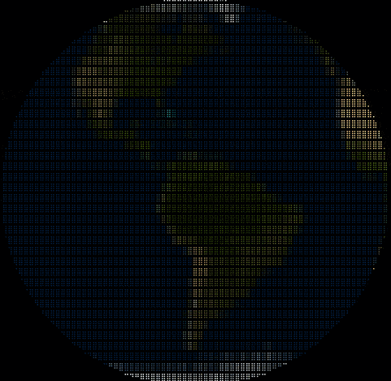

# drawille-cr

[](https://travis-ci.org/joeyrobert/drawille-cr)

Based on the the [drawille](https://github.com/asciimoo/drawille) library for Python,
this library allows the developer to draw using Unicode braille symbols in the terminal.



### Notes

The library extends drawille to support RGB colors in the terminal.
It doesn't attempt to degrade gracefully to terminals that don't support RGB.
This library is very much a work in progress. If there's functionality in it
that you wish to see, please feel free to fork or submit a pull request.

## Usage

```crystal
require "drawille-cr"

c = Drawille::Canvas.new

(0..180).each do |x|
  c.set(x, (10 + Math.sin(x * 2 / Math::PI * 10) * 10).to_i32)
end

print c.render
```


See [examples](examples) for more info on how to use, or read the [implementation](drawille-cr).

## Installation

Add this to your `shard.yml` file:

```
dependencies:
  drawille-cr:
    github: joeyrobert/drawille-cr
    branch: master
```

## License

### AGPLv3

```
drawille-cr is free software: you can redistribute it and/or modify
it under the terms of the GNU Affero General Public License as published by
the Free Software Foundation, either version 3 of the License, or
(at your option) any later version.

drawille-cr is distributed in the hope that it will be useful,
but WITHOUT ANY WARRANTY; without even the implied warranty of
MERCHANTABILITY or FITNESS FOR A PARTICULAR PURPOSE.  See the
GNU Affero General Public License for more details.

You should have received a copy of the GNU Affero General Public License
along with drawille-cr. If not, see < http://www.gnu.org/licenses/ >.

(C) 2014- by Adam Tauber, <asciimoo@gmail.com>
(C) 2020- by Joey Robert, <joey@joeyrobert.org>
```
